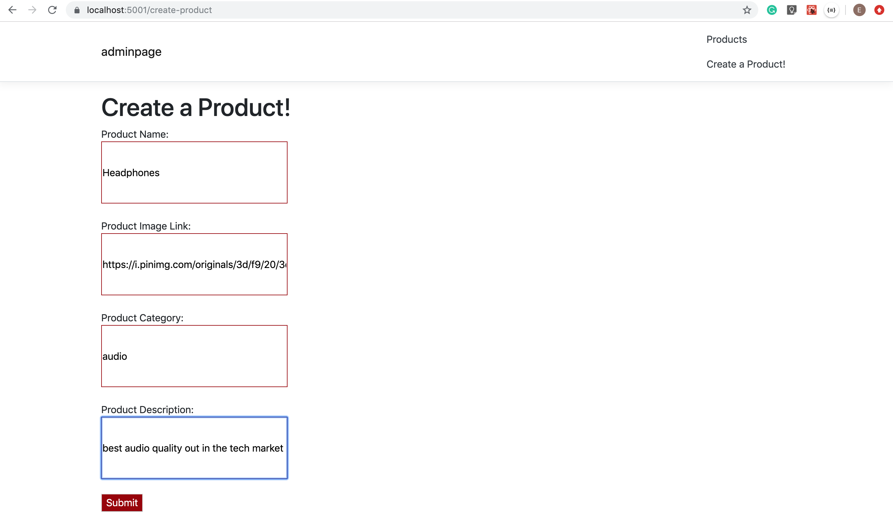
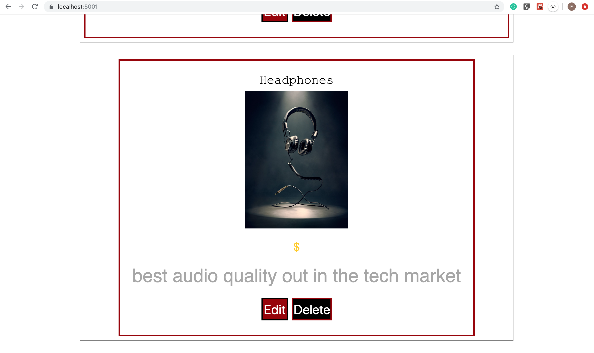
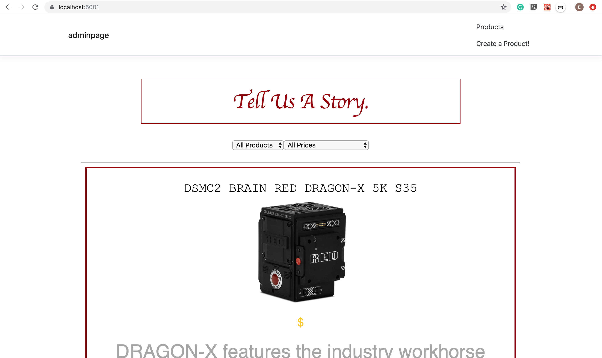
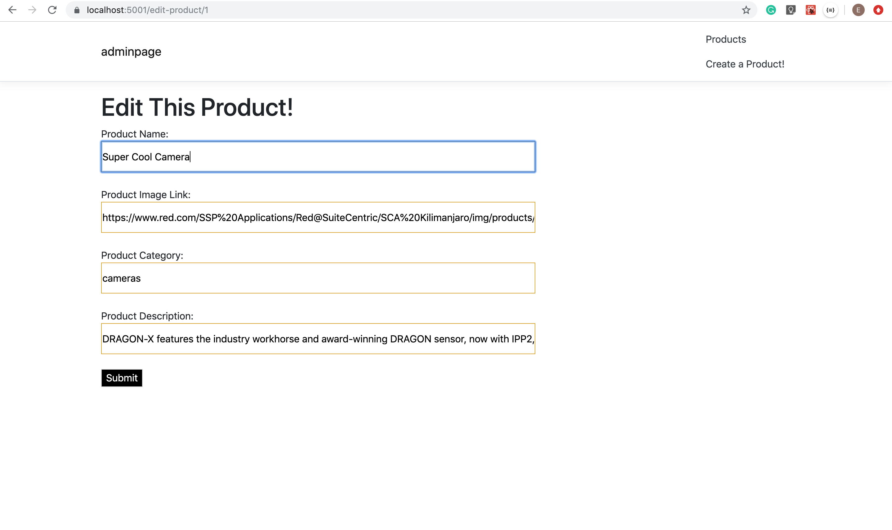
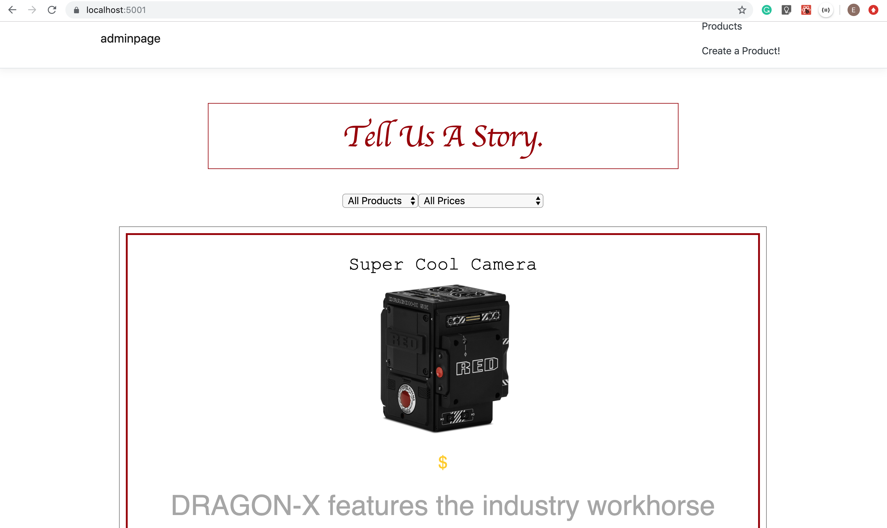
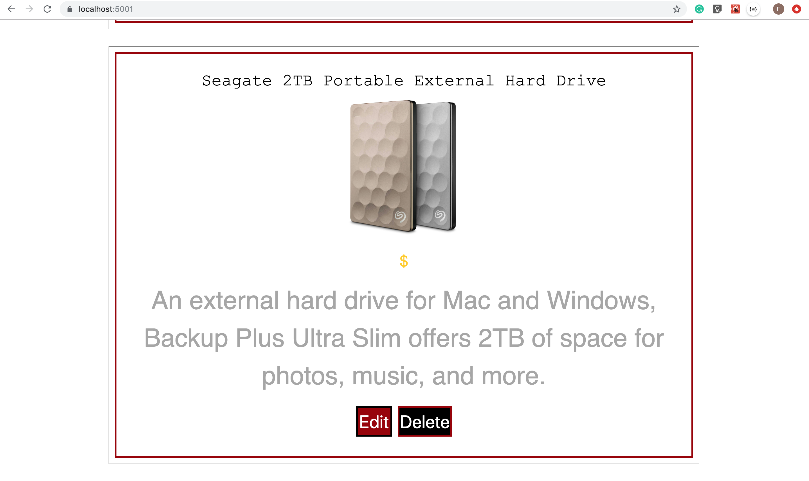

# storygear-phase4
Story Gear, admin style with a C Sharp server! Uses all the CRUD mentods.

## Start-Up
To start this Story Gear app up simply run the command: 
- dotnet run 

in the root of the project.

## CREATE
### The following shows how to create a new product - 
#### Can be found in: storygear-phase4/ClientApp/src/components/Create/create-product.js

## READ
### The following shows the products (although they couldn't fit in the screenshot)
#### Can be found in: storygear-phase4/ClientApp/src/components/Products/index.jsx

## UPDATE
### The following shows the update from the actual 'RED camera name' to 'Super Cool Camera'
#### Can be found in: storygear-phase4/ClientApp/src/components/Edit/edit-product.js

## DELETE
### The following shows how the headphone product was deleted from the list
#### Can be found in: storygear-phase4/ClientApp/src/components/Products/ListProducts.jsx

